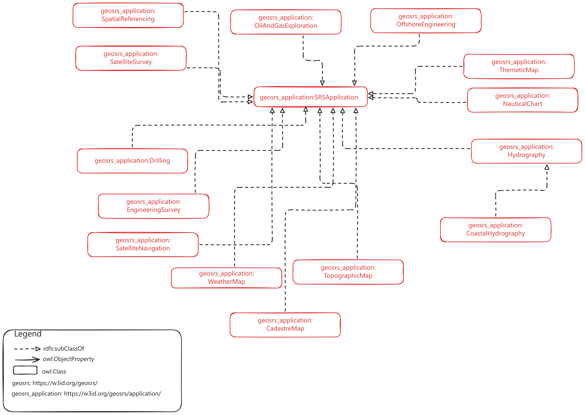

## SRS Ontology Application Module

This module describes how to model an SRS application entity using the SRS ontology vocabulary.

SRS Application classes and properties are described under the namespace https://w3id.org/geosrs/application/

