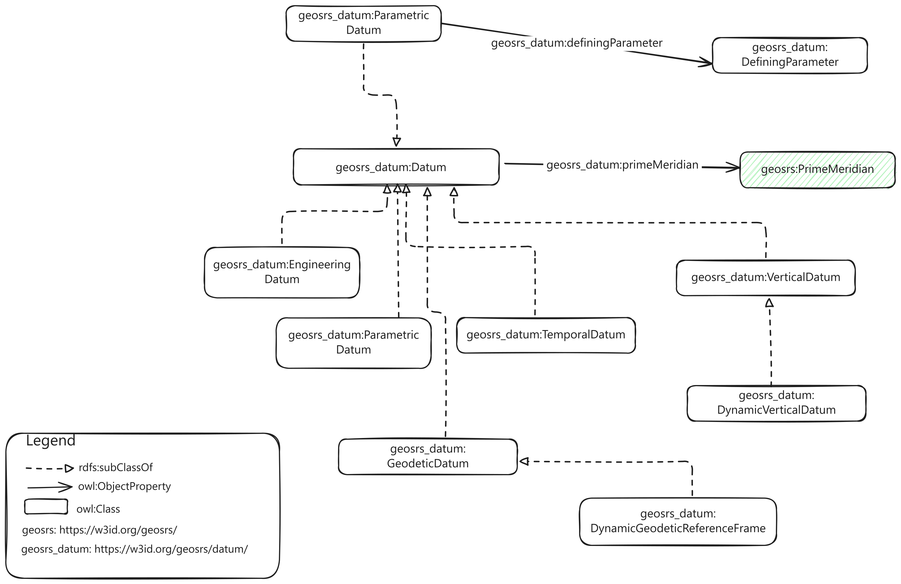

## SRS Ontology Datum Module

This module describes how to model a datum using the SRS ontology vocabulary.

Datum classes and properties are described under the namespace https://w3id.org/geosrs/datum/

