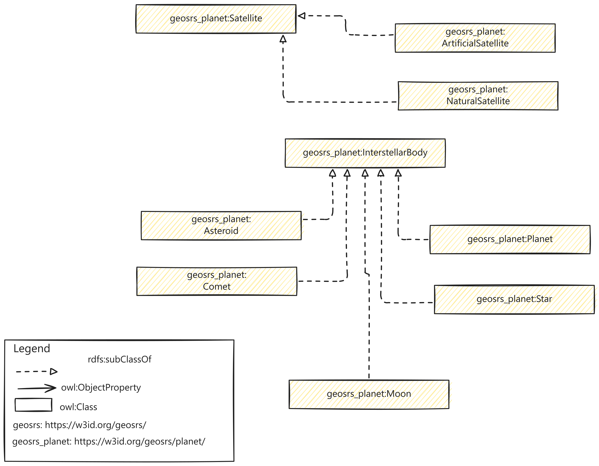

## SRS Ontology Planet Module

This module describes how to model a planetary entity using the SRS ontology vocabulary.

Planet classes and properties are described under the namespace https://w3id.org/geosrs/planet/

